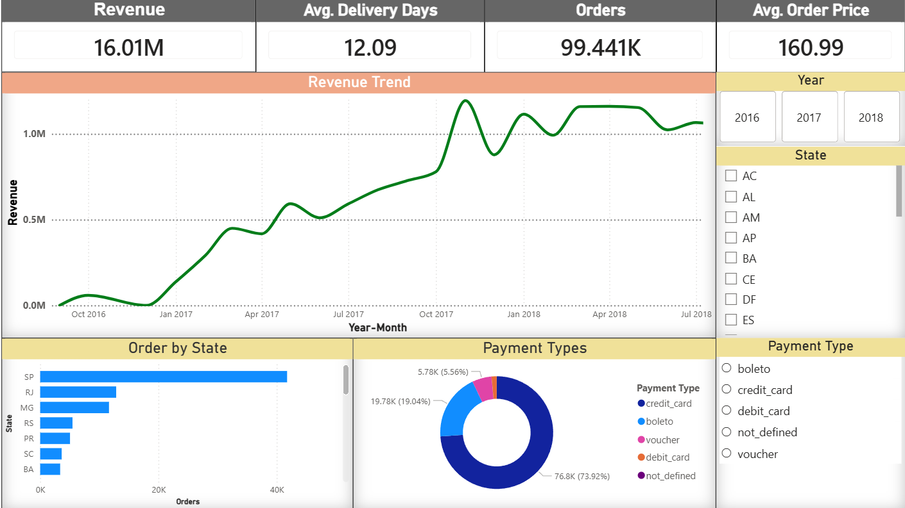
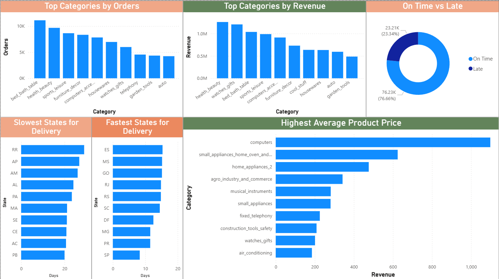

# 🛒 E-Commerce Sales & Delivery Analytics

An end-to-end Data Analytics project built using **Python** and **Power BI** to analyze customer behavior, sales performance, product categories, payment methods, and delivery efficiency in an e-commerce business.

---

## 📌 Project Objective

The goal of this project is to:

* Analyze sales and customer trends
* Identify top-performing product categories
* Understand payment behavior
* Evaluate delivery performance
* Build an interactive Power BI dashboard for business insights

---

## 🛠️ Tools Used

* Python
* Pandas
* NumPy
* Matplotlib
* Power BI
* DAX

---

## 📂 Dataset

Brazilian E-Commerce Public Dataset by Olist:

Dataset Source: https://www.kaggle.com/datasets/olistbr/brazilian-ecommerce

---

## 🔍 Analysis Performed

### Data Preparation

* Missing value analysis
* Duplicate checks
* Data type conversion
* Feature engineering

### Sales Analysis

* Monthly order trends
* Revenue trends
* Average Order Value (AOV)

### Customer Analysis

* Orders by state
* Orders by city

### Product Analysis

* Top categories by orders
* Top categories by revenue
* Highest average product price categories

### Delivery Analysis

* Average delivery time
* Fastest delivery states
* Slowest delivery states
* On-time vs delayed deliveries

---

## 📊 Dashboard

### Page 1: E-Commerce Sales Dashboard

* Total Revenue
* Total Orders
* Average Order Value
* Average Delivery Days
* Revenue Trend
* Orders by State
* Payment Type Distribution

### Page 2: Product & Delivery Performance Dashboard

* Top Categories by Orders
* Top Categories by Revenue
* Highest Average Product Price Categories
* Fastest Delivery States
* Slowest Delivery States
* On-Time vs Late Deliveries

Power BI Dashboard File:

https://drive.google.com/file/d/1j75Ks3gO71t3dE0b0SwCkmyRJ0ACdaVQ/view?usp=drive_link

---

## 📈 Key Insights

* São Paulo contributed the highest number of orders.
* Top 10 cities generated approximately 35% of all orders.
* Credit Card was the most preferred payment method (~74%).
* Health & Beauty generated the highest revenue.
* Bed Bath Table was the most ordered product category.
* Around 76% of deliveries were completed on time.
* Northern states generally experienced longer delivery times.

---

## 📷 Dashboard Preview

### Sales Dashboard

### Product & Delivery Dashboard

---

## 🎯 Skills Demonstrated

* Data Cleaning
* Exploratory Data Analysis (EDA)
* Data Visualization
* Feature Engineering
* Business Insight Generation
* Power BI Dashboard Development
* DAX Measures

---

## 🚀 Project Outcome

This project demonstrates a complete analytics workflow:

**Raw Data → Cleaning → Analysis → Insights → Interactive Dashboard**
